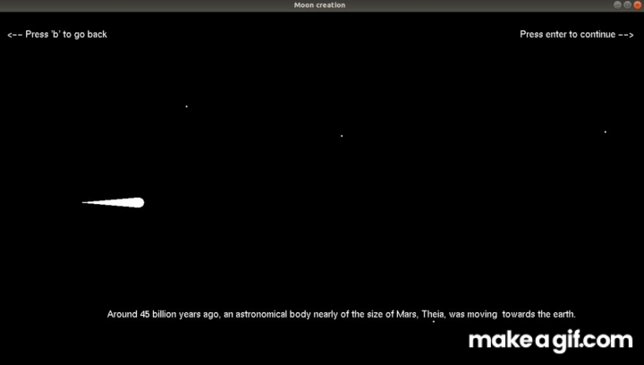

# CG-mini-project

## CREATION OF MOON :last_quarter_moon_with_face:
*A Computer Graphics project using OpenGL*  
The giant-impact hypothesis, sometimes called the Big Splash, or the Theia Impact suggests that the Moon formed out of the debris left over from a collision between Earth and an astronomical body the size of Mars,
approximately 4.5 billion years ago.

## Pre-Requisites
*(for Linux users)*
- GLUT library  
   - Fire up the terminal (Ctrl + Alt + T) 
   - Type in the command  
	 `sudo apt-get install freeglut3-dev`
   
 - SOIL (Simple OpenGL Image Library)
   - Fire up the terminal again
   - Type in the command  
	 `sudo apt-get install libsoil-dev`

## Steps to run
 - Type the following commands in the terminal  
    - `gcc moon.c -lm -lGL -lGLU -lglut -lSOIL`
    - `./a.out`
### This is how it looks
*Kindly ignore the watermark* :stuck_out_tongue: :sweat_smile:
    

  

